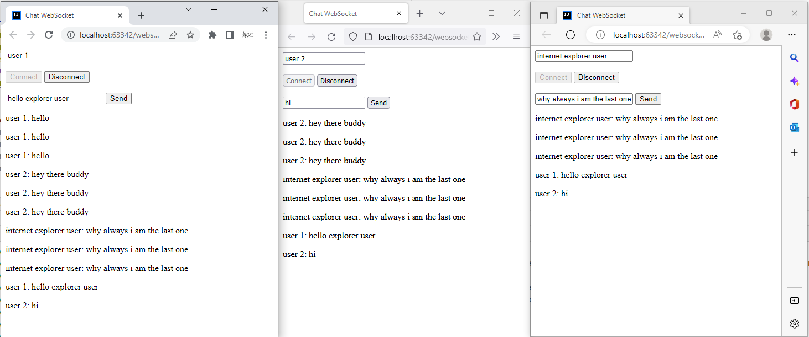

### websocket example with SockJS and Stomp

##### followed sources:

```console
https://www.youtube.com/watch?v=a3tFsL6vSJA
```
```console
https://www.youtube.com/watch?v=m0K3ElazGE0
```

```console
https://github.com/HaydiKodlayalim/spring-examples/tree/master/spring-boot-websocket
```

#### you can use the tester.html to test the WebSocket by opening it in different browsers and then joining the same chat room and sending messages to others

#### example screenshot of chat room : 

